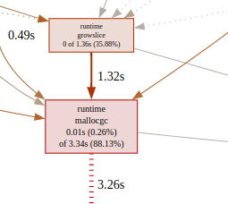
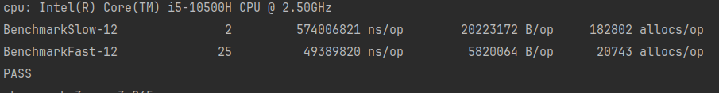
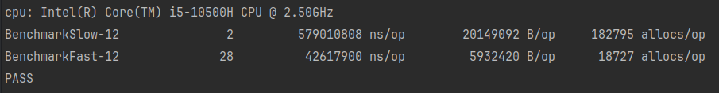

## Отчёт по профилированию

1. Скриншоты показателей по cpu и mem до профилирования:

По данному скриншоту видно, что много cpu time уходит на regexp MatchString и regexp compile а также на json.
Тут мы делаем оптимизацию двух пунктов: Regexp и json.
1. Для regexp мы используем прекомпиляцию
2. Для json easyjson:

Сделали прекомпиляцию, получили следующие результаты:

Теперь fast search, буквально касается regexp compile и уделяет ему 0.01s, уменьшили общее время работы на 1.61s.
Следующий шаг оптимизации, подключение библиотеки easyJSON и генерация кода.
Подключили easyjson, сделали тесты:

Уменьшили время работы на 0.08s.

Следующий горячий участок в котором FastSearch и SlowSearch это вызов функции growslice и выделение новой памяти:

Заранее преаллоцируем размер в 2048 элементов для массива пользователей, в массиве browsers для 16-и элементов также, посмотрим на результаты:

До заранее преаллоцированного пространства:

После:

Скорость работы программы увеличилась на 15%.

